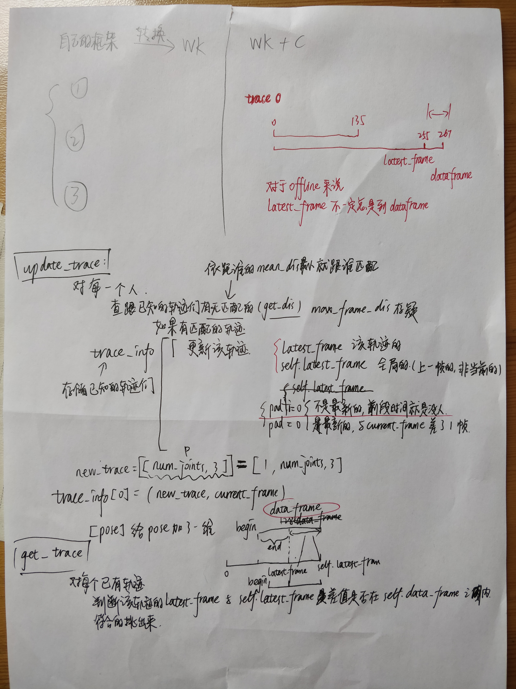

Spatial Temporal Graph Convolutional Networks for Skeleton-Based Action Recognition.

<!–-break-–>

[paper](../resources/Spatial&#32;Temporal&#32;Graph&#32;Convolutional&#32;Networks&#32;for&#32;Skeleton-Based&#32;Action&#32;Recognition.pdf) 
[code](https://github.com/littlepure2333/st-gcn)

----------------------------------------
- [x] [17->18关节点](##17->18关节点)
- [x] [realtime_demo渲染慢](##realtime_demo渲染慢)
- [x] [鬼影问题](##鬼影问题)
- [ ] [训练数据](##训练数据)

----------------------------------------

## 17->18关节点
st-gcn输入18个关节点，而HRNet输出17个关节点（少了neck），用左肩和右肩平均代替
> 关节点标注见OneNote:/PRIS/notes/Keypoint 关节点标注
TBD...

## realtime_demo渲染慢
python显示视频慢，直接保存到本地png，打开png会自动刷新，与视频无异    
但还是最好找到高性能的视频包
TBD...

## 鬼影问题
**Problem**    
offline_demo中骨架总是比真人慢几拍，有的视频会这样但有的却不会，而且realtime_demo不会出现这个问题
<video src="../resources/swipe1_dataframe_250.mp4" width="480" controls preload></video>

**Solution**   
在视频渲染函数[^1]的输入参数中 骨架和视频是分开的，说明生成的骨架就已经有了偏移。    
生成骨架是由 demo 中的 naive_pose_tracker类 负责的，而原作者也说了这个class是简单写的，可能会有问题。    

""" A simple tracker for recording person poses and generating skeleton sequences.
For actual occasion, I recommend you to implement a robuster tracker.
Pull-requests are welcomed.
"""


 

溯因后发现根本原因在于 get_skeleton_sequence函数中假设 trace 的 latest_frame 能达到 data_frame   
而对于offline_demo来说latest_frame不一定总是达到data_frame（offline的data_frame等于视频长度）    
但对于realtime_demo来说视频渲染函数输入是单帧的骨架

修改get_skeleton_sequence中end的计算即可

- end = self.data_frame - (self.latest_frame - latest_frame)
+ end = latest_frame


<video src="../resources/swipe1_no_problem.mp4" width="480" controls preload></video>

## 训练数据
训练精度不变，label不变   
TBD...

[^1]: utils.visualization.stgcn_visualize