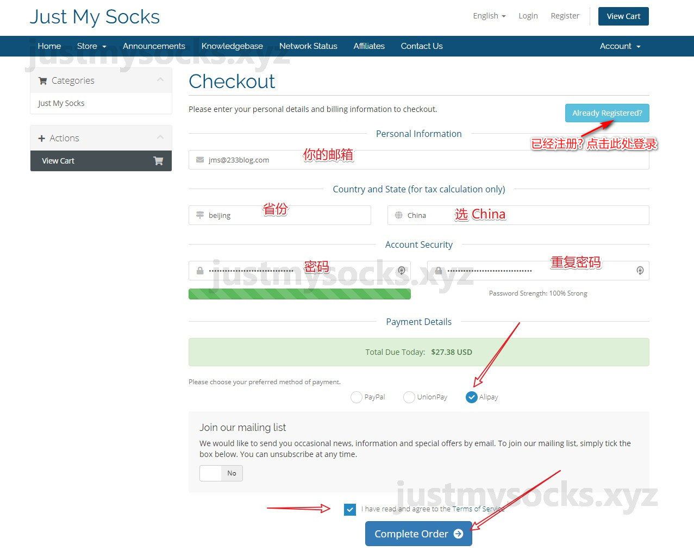
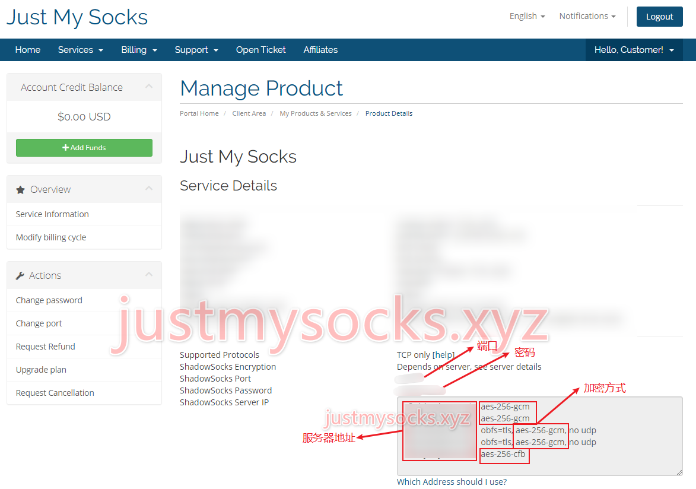
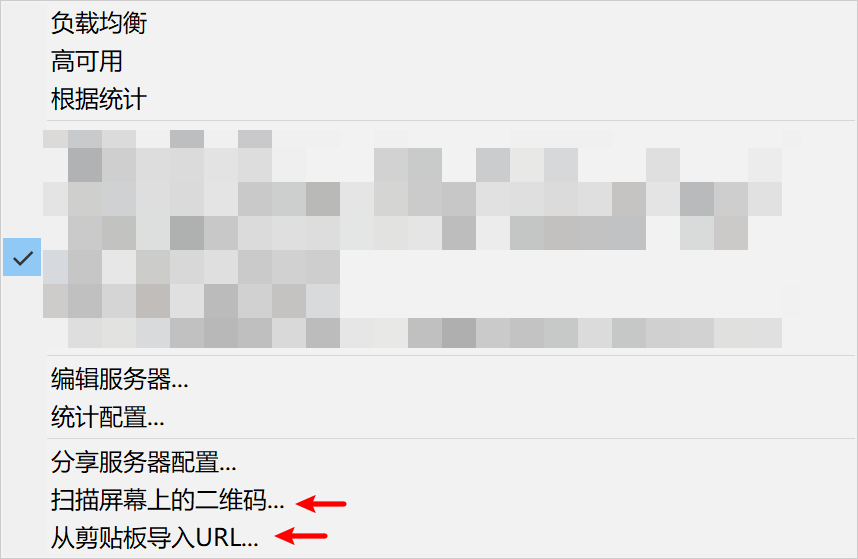
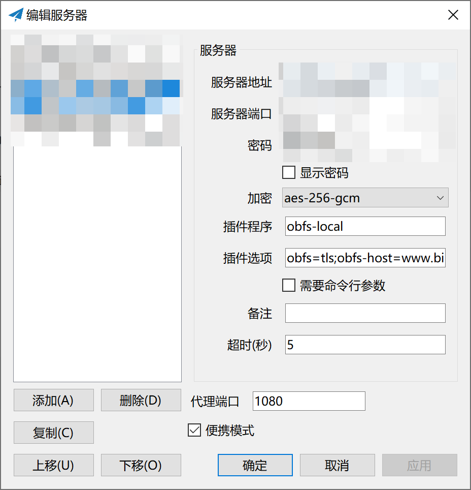
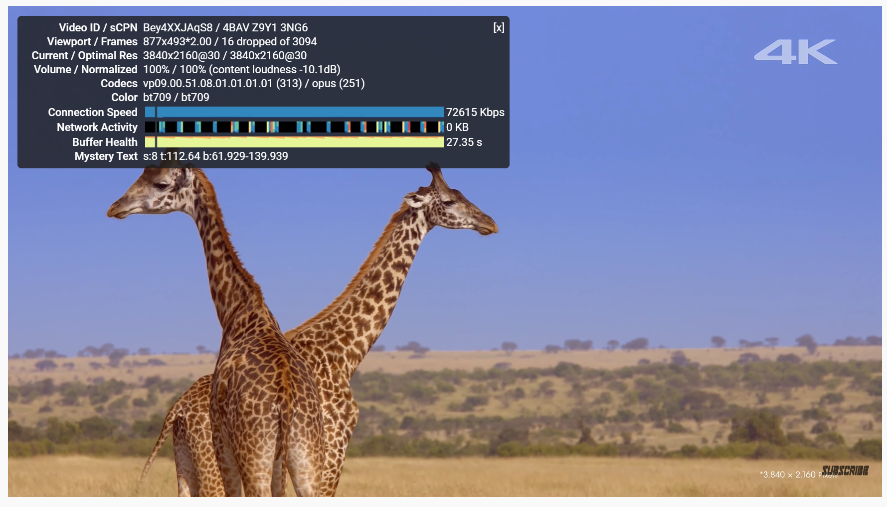

今天我的洛杉矶vultr被封了，19年vultr其实都被用滥了，本想换一家，但恋于账户里还有20美刀，连买了日本，新加坡，洛杉矶，法兰克福四个地方的vps竟然全部被封，气的我转投其他的vps服务商。   
机缘巧合之中碰到了Just My Socks，甚好用，特此记录过程，此篇文章只是为了备份，在此感谢原教程：https://justmysocks.xyz/buy-justmysocks/
> Just My Socks 是搬瓦工官方机场，justmysocks 使用搬瓦工自家的优质 CN2 GIA 线路，并且支持自动换 IP，无须担心 IP 被墙！

<!–-break-–> 

# Just My Socks 介绍

Just My Socks 是**搬瓦工官方提供**的 Shadowsocks 代理服务

Just My Socks 官网地址：https://justmysocks.net (需要挂梯子才能访问)
Just My Socks 官网地址备用：https://justmysocks2.net

Just My Socks 使用搬瓦工最新 DC6[^1] 机房 CN2 GIA[^2] 高速线路，并且有高达 5G CN2 GIA线路可供选择，这是目前最好用的 CN2 GIA 线路了，有多组服务器地址备用，完全无须担心任何网络问题，最重要的是再也不用担心 IP 被墙了！

justmysocks 会自动监测所有套餐的节点 IP 是否可用，如果 IP 被墙了，便会自动更换新的 IP，这一切都是自动化的，妈妈再也不用担心我的 IP 被墙了！

我们习惯将提供 Shadowsocks 服务的商家，称作机场。所以 justmysocks 便是搬瓦工机场或者 JMS 机场！

由于是搬瓦工官方提供的服务，跑路什么的是不存在的啦~ 并且也是支持退款的！

Just My Socks 优点如下

由搬瓦工官方出品，质量安全可靠
无须自己再折腾搭建了
妈妈再也不用担心我的 IP 被墙了！
支持支付宝付款，同时支持退款
优质 CN2 GIA 线路，高达 5G 带宽的 CN2 GIA 线路可供选择
支持更改密码 / 加密方式 / 服务器端口

## Just My Socks 套餐
Just My Socks 套餐如下

|套餐	|带宽	|设备	|流量	|协议	|价格	|链接|
|---|---|---|---|---|---|---|
Just My Socks 100	|1 G	|3 设备限制	|100 GB /月	|TCP	|$2.88 / 月	|已下架
Just My Socks 500	|2.5 G	|5 设备限制	|500 GB /月	|TCP & UDP	|$5.88 / 月	|[购买](https://justmysocks2.net/members/cart.php?a=add&pid=2)
Just My Socks 1000	|5 G	|无限制	|1TB /月	|TCP & UDP	|$9.88 / 月	|[购买](https://justmysocks2.net/members/cart.php?a=add&pid=3)
Just My Socks 5000	|5 G	|无限制	|5TB /月	|TCP & UDP	|$48.99 / 月	|[购买](https://justmysocks2.net/members/cart.php?a=add&pid=4)

套餐内容来自 Just My Socks 官网：https://justmysocks2.net/members/cart.php

~~温馨提示，Just My Socks 100 套餐已经下架~~

**哪个套餐好？**
简单点，对于绝大多数普通人来说买个最便宜的套餐就行啦！当然，如果你土豪的话，直接买最贵的，不用犹豫！
> 我买的是5.88/月的套餐

需要留意的是：**设备限制**，这个限制对于需要多个设备同时使用的同学来说，可能有些头痛，设备限制指的是多个设备同时使用，比如说，手机，平板，电脑。如果你需要同时在多个设备上使用 SS 的话，又或者说你要分享给同学朋友一起使用的话，这个时候你必须要考虑一下这个设备限制的局限了，以避免出现不能同时使用的情况。

如果你需要玩外服游戏或者有需求要使用国外的 IM 的软件来视频通话或语音通话等，记得选择购买支持 UDP 协议的套餐。

除开最直接的流量限制和限制设备限制之外，还有另外一个带宽区别，这个东东毫无疑问当然是越大越好！

不管如何，一分钱一分货！选择适合自己的套餐即可，没有什么是加钱解决不了。

> 如果出现 out of stock 这样的提示，那就是这个套餐没货啦。

## 购买
在上面表格中选择想要购买的套餐，点击 购买 即可。

在 Choose Billing Cycle 选项那里选择：**$xxxx USD Annually**，是按年付的意思，按年付，每年仅需十个月的费用，搬瓦工机场不同于其他机场，是绝对不会跑路的，并且支持退款，所以就算是年付也无须有任何担心的。

之后点击 **Continue** 将套餐添加到购物车

**结账**
使用 Just My Socks 优惠码： JMS9272283

这个justmysocks优惠码拥有 5.2% 的优惠，也是目前唯一可用的justmysocks优惠码，并且续费可用。

你可以在这里找到更多 [Just My Socks 优惠码](https://justmysocks.xyz/justmysocks-promo-code/)

输入优惠码后，再点击 **Validate Code**，便会使用优惠码了

如果没有什么问题，点击 Checkout 继续

**付款**
请按照下面图片上的提示来填写账号相关~

提醒一下，Country 选项记得选择 **China**，付款方式选择 **Alipay**
务必要勾上 I have read and agree to the Terms of Service

然后点击 **Complete Order**

之后浏览器会自动跳转到支付宝付款界面，手机扫码完成付款即可。

> 提醒，如果点击 Complete Order 之后出现了卡住的情况，请先 注册 Just My Socks 账号 再购买。

## 查看 Shadowsocks 配置信息
确保你已经完成付款

在 Just My Socks 官网菜单，选择 Services > My Services

便会看到已购买的产品，Status 显示 Active 的，即为当前可用的产品！

点击进去就能看到 Shadowsocks 配置，如下图所示

一共有五组服务器地址，端口跟密码都是相同的，然后加密方式请按照给出的内容正确选择！

如果有显示 **obfs=tls** 的即是启用了 obfs 混淆的，得正确配置才能正常使用

然后，如果有显示 **no udp** 的代表不支持 UDP 流量。

往下拉你就会看到配置二维码和链接信息，可以选择扫描二维码或快速导入使用。

你会发现 Just My Socks 给的服务器地址是域名地址，这样来，如果出现 IP 被墙了，Just My Socks 官方只要将域名解析到新的 IP 地址即可。这些东西你是不用关心的，Just My Socks 官方会自动检测节点 IP 的可用性，如果不能正常使用，例会将域名地址更新为新的 IP。

备注：Just My Socks 给了几组地址那就配置几个 Shadowsocks 来使用，避免出现单个节点不可用的情况。

## 更改配置
如果你需要更改 Shadowsocks 密码，点击 Change password 即可

如果你需要更改 Shadowsocks 端口，点击 Change port 即可

更改成功会显示：Changes saved. Please wait 1 minute for settings to propagate to all servers.

就是说需要等待 1分钟 将设置同步到所有服务器

之后点击左侧的 Service Information 选项卡即会看到新的内容了

提醒：更改密码和更改端口是随机生成的，目前不支持自定义。

建议将加密方式更改为 aes-256-gcm，点击 Switch to aes-256-gcm 即可

提醒：Just My Socks 于 2019-9-29 开始，加密方式默认已更改为 aes-256-gcm，并且不能更改

**验证你的邮箱**
OK，到这里，你肯定大概已经了解清楚 Just My Socks 的一些操作了，但是你可能还没有验证邮箱，推荐验证邮箱以完成账号的注册。

在你邮箱可以找到 Just My Socks 的邮件，如果没有看到，建议查看一下垃圾箱，然后按照提示，点击一下邮件中链接进行验证即可。

**升级套餐**
Just My Socks 支持升级套餐，如果你的 Just My Socks 套餐流量不能满足你的使用需求，你可以选择升级 Just My Socks 套餐。

**更改结算周期**
你可以自由的更改 Just My Socks 套餐的结算周期，比如说将月付更改成年付，这样可以减少一些支出费用。

**续费教程**
Just My Socks 会提前七天出续费账单，我们只要将 Just My Socks 的账单付款即可，以避免服务过期或被停止。

**退款**
如果你觉得 Just My Socks 不能满足你的需求，那么你可以申请退款的。

# 配置shadowsocks客户端

Just My Socks提供了5个IP：   
前 3 个 IP（cXs1、cXs2、cXs3）通过中国电信提供的 CN2 GIA 网络进行路由。这被认为是连接中国与世界其他地区的最佳方式。

最后 2 个 IP（cXs4 和 cXs5）通过 CN2 GT 网络路由，并附加了中国联通和中国移动的直接连接。

此外，我们还在服务器 cXs3 （CN2 GIA） 和 cXs4 （CN2 GT） 上启用了 obfs 插件 （obfs_tls）

## 普通配置

推荐选择扫描二维码或快速导入使用，以避免出现输错配置信息的情况

## obfs配置
[obfs](https://github.com/shadowsocks/simple-obfs) 是一个设计用于混淆 Shadowsocks 流量的工具，其原理是在 Shadowsocks 流量前面添加一层加密，以伪装成是在正常的访问网站，obfs 的实现有两种方式，一种是 HTTP，另外一种是 TLS。Just My Socks 支持的是 TLS 方式，此伪装性更加隐蔽，安全性更高

用于 Windows 的 OBFS 插件：[obfs-local](https://github.com/shadowsocks/simple-obfs/releases)   
下载zip后将解压后的两个文件放到Shadowsocks的文件夹中

在客户端上配置obfs如图

* 插件程序里面填 obfs-local
* 插件选项里面填 obfs=http;obfs-host=www.bing.com
> 因为Just My Socks 的 obfs 方式是TLS, 可不要填成了~~obfs=http~~   
> obfs-host 可以填成任意国内可以访问的网站（比如obfs-host=www.baidu.com)

最后实测 Youtube 4K 无压力哈哈哈

[^1]: 搬瓦工DC6机房的名称是USCA_6，使用的线路是搬瓦工CN2 GIA-E（即CN2 GIA ECOMMERCE的缩写，中文意思是CN2 GIA商务优化，是搬瓦工2019年推出的一条新的线路），搬瓦工DC6机房目前为Zenlayer（C3机房）的CN2 GIA + Hivelocity AS29802，2.5Gbps起步，最高10Gbps带宽，三网CN2 GIA，是目前最快的线路。

[^2]: 搬瓦工CN2 GIA线路是“Global Internet Access”的缩写，是电信CN2系列产品中的最高端产品，中国移动和联通则是使用由中国电信提供的CN2 GIA，即三网CN2 GIA。它有独立的回国链路，具有最高优先级服务，即便是在高峰时段也能获得最佳的体验效果。P.S.本来在搬瓦工上单独买vps是很贵的，但是在JustMySocks上却非常超值。