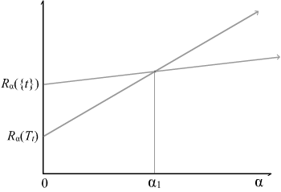
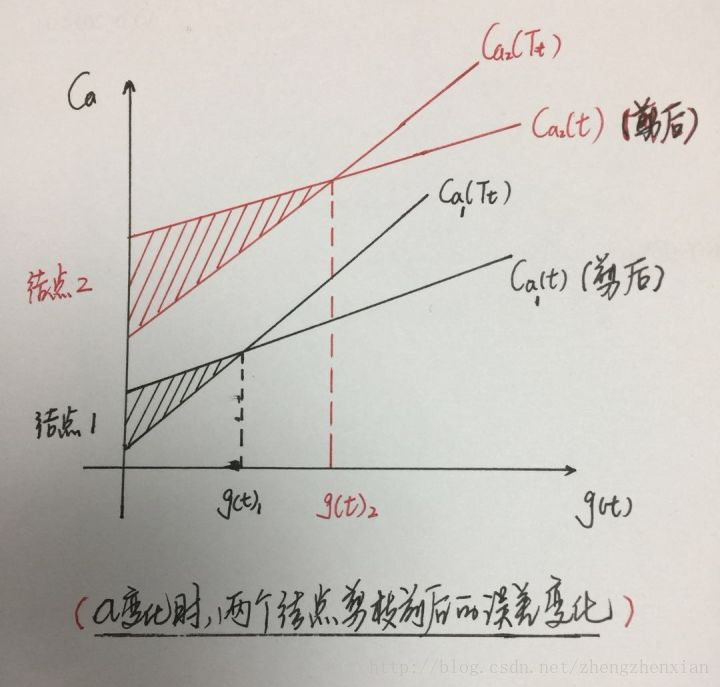
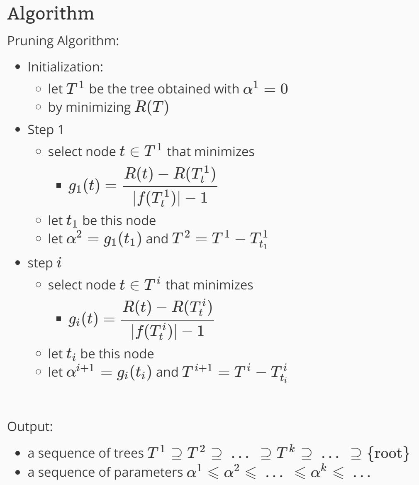
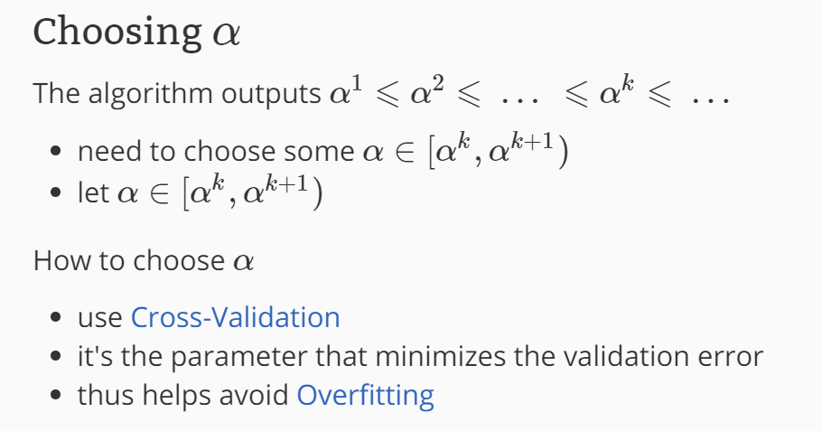

由于生成的决策树存在过拟合问题，需要对它进行剪枝，以简化学到的决策树。决策树的剪枝，往往从已生成的树上剪掉一些叶节点或叶节点以上的子树，并将其父节点或根节点作为新的叶节点，从而简化生成的决策树。   
《统计学习方法》书上讲的关于CART决策树的剪枝算法有些不好懂，结合网上资料和自己的理解记录一下。
<!–-break-–> 

***************

CART剪枝算法由两步组成：
1. 首先从生成算法产生的决策树$T_0$底端开始不断剪枝，直到$T_0$的根节点，形成一个子树序列$\{T_0,T_1,...,T_n\}$；
2. 然后通过交叉验证法在独立的验证数据集上对子树序列进行测试，从中选择最优子树。

*******************

# 1 剪枝，形成一个子树序列

## 1.1 损失函数
我们剪枝是跟据损失函数这一指标来进行的。在剪枝过程中计算子树的损失函数：
\$\$C_\alpha(T) = C(T) + \alpha|T|\$\$

其中，$T$为任意子树，$C(T)$为对训练数据的预测误差（如基尼指数），$\|T\|$为子树的叶节点个数，$\alpha\geqslant0$为参数，$C_\alpha(T)$为参数是$\alpha$时的子树$T$的整体损失。参数$\alpha$权衡训练数据的拟合程度与模型的复杂度。

具体的，训练数据的预测误差的计算公式为：
\$\$C(t) = \sum_{t=1}^{|T|}N_t Gini(t)\$\$

其中，$t$是树$T$的叶节点，该叶节点有$N_t$个样本点，$Gini(t)$为$t$的基尼系数。   
因为CART树是二叉树，所以每一个叶节点$t$也都是二分类问题。   
对于二分类问题（$K=2$），若样本点属于第1个类的概率是$p$，则概率分布的基尼系数为
\$\$Gini(p)=\sum_{k=1}^K p_k(1-p_k) = 2p(1-p)\$\$

## 1.2 嵌套子树序列
Breiman等人证明：可以用递归的方法对树进行剪枝。将$\alpha$从小增大，$0 = \alpha_0 < \alpha_1 < ... < \alpha_n < +\infty$，产生一系列的区间$[\alpha_i,\alpha_{i+1}),i = 0,1,...,n$；剪枝得到的子树序列对应着区间$\alpha\in[\alpha_i,\alpha_{i+1}),i = 0,1,...,n$的最优子树序列$\{T_0,T_1,...,T_n\}$，序列中的子树是嵌套的。

这个过程怎么解释呢？从整体树$T_0$开始剪枝。对$T_0$的任意内部节点t，以t为单节点树的损失函数是
\$\$C_\alpha(t) = C(t) + \alpha\$\$
> 因为此时$\|t\|=1$，所以等式后面加的就是$\alpha*1$

以$t$为根节点的子树$T_t$的损失函数是
\$\$C_\alpha(T_t) = C(T_t) + \alpha|T_t|\$\$

我们可以观察当$\alpha$变化时，这两个损失函数有什么样的变化趋势呢？
书上也说了：
当$\alpha = 0$及$\alpha$充分小的时候，有不等式
\$\$C_\alpha(T_t) < C_\alpha(t)\$\$    
当$\alpha$增大时，在某一$\alpha$有
\$\$C_\alpha(T_t) = C_\alpha(t)\$\$   
当$\alpha$再增大时
\$\$C_\alpha(T_t) > C_\alpha(t)\$\$  
只要$\alpha = \frac{C(t) - C(T_t)}{|T_t| - 1}$，$T_t$与$t$有相同的损失函数值，而$t$的节点少，因此$t$比$T_t$更可取，对$T_t$进行剪枝。

> 对于这段话怎么理解呢，看一下下面这个图
>    
> 在交点$\alpha_1$之前，$T_t$的损失函数要更小一些，也就是没剪枝要好一些;而在交点$\alpha_1$之后，$t$的损失函数要更小一些，也就是该剪枝了。   
> (P.S.关于一开始为什么\$C_\alpha(T_t) < C_\alpha(t)\$找遍全网没有一个地方解释清楚，最后在scikit的文档里面找到一个算是能解释的说法吧：   
> In general, the impurity of a node is greater than the sum of impurities of its terminal nodes.

为此，对$T_0$中每一内部节点$t$，计算
\$\$g(t) = \frac{C(t)-C(T_t)}{|T_t| - 1}\$\$   
它表示剪枝后整体损失函数减少的程度。在$T_0$中减去$g(t)$最小的$T_t$,将得到的子树作为$T_1$，同时将最小的$g(t)$设为$\alpha_1$，$T_1$为区间$[\alpha_1,\alpha_2)$的最优子树。如此剪枝下去，直至得到根节点，在这一过程中，不断地增加$\alpha$的值，产生新地区间。

> 这一段怎么理解呢，看一下下面这个图
> 
> 为什么要选择最小的g(t)呢？以图中两个点为例，结点1和结点2，g(t)2大于g(t)1, 假设在所有结点中g(t)1最小，g(t)2最大，两种选择方法：   
> 当选择最大值g(t)2，即结点2进行剪枝，但此时结点1的不修剪的误差大于修剪之后的误差，即如果不修剪的话，误差变大，依次类推，对其它所有的结点的g(t)都是如此，从而造成整体的累计误差更大。   
> 反之，如果选择最小值g(t)1，即结点1进行剪枝，则其余结点不剪的误差要小于剪后的误差，不修剪为好，且整体的误差最小。   
> 从而以最小g(t)剪枝获得的子树是该$\alpha$值下的最优子树！这样一步一步出来的树也是嵌套的

完整的剪枝算法过程如图   

# 2 在剪枝得到的子树序列$T_0,T_1,...,T_n$中通过交叉验证选取最优子树$T_\alpha$

具体地，利用独立的验证数据集，测试子树序列$T_0,T_1,...,T_n$中各棵子树的误差（回归的话使用平方误差，分类的话使用基尼指数）。误差最小的决策树被认为是最优的据册数。在子树序列中，每棵子树$T_0,T_1,...,T_n$都对应一个参数$\alpha_1,\alpha_2,...,\alpha_n$。所以，当最优子树$T_k$确定时，对应的$\alpha_k$也确定了，即得到了最优决策树$T_\alpha$。

完整的选取过程如图

# 参考
https://blog.csdn.net/zhengzhenxian/article/details/79083643

https://zhuanlan.zhihu.com/p/85731206

https://scikit-learn.org/stable/modules/tree.html#minimal-cost-complexity-pruning

https://scikit-learn.org/stable/auto_examples/tree/plot_cost_complexity_pruning.html#sphx-glr-auto-examples-tree-plot-cost-complexity-pruning-py

https://en.wikipedia.org/wiki/Decision_tree_pruning#Cost_complexity_pruning

http://mlwiki.org/index.php/Cost-Complexity_Pruning

https://online.stat.psu.edu/stat508/lesson/11/11.8/11.8.2