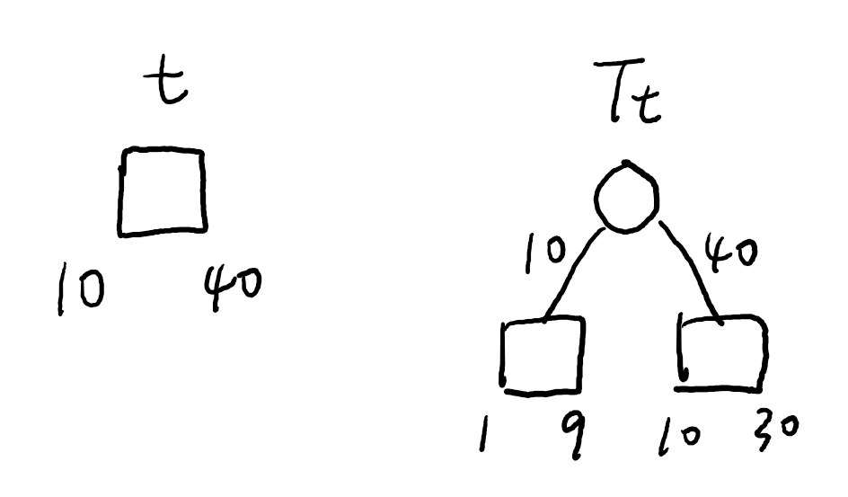
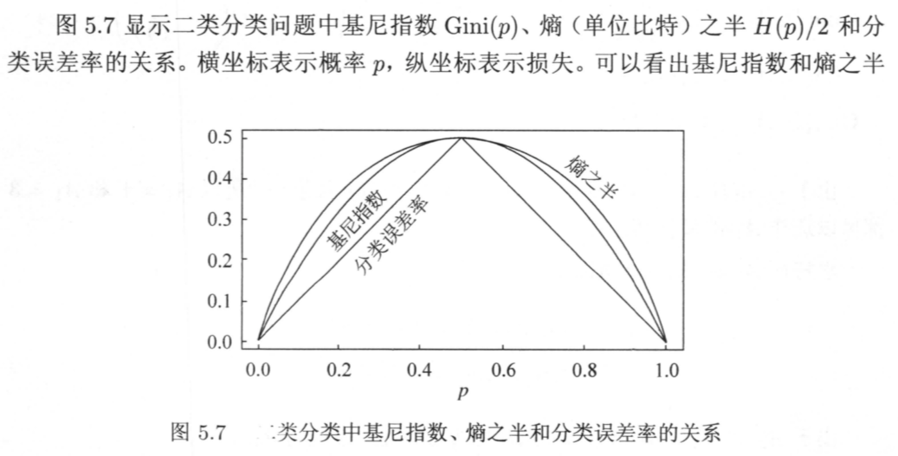

由于生成的决策树存在过拟合问题，需要对它进行剪枝，以简化学到的决策树。决策树的剪枝，往往从已生成的树上剪掉一些叶节点或叶节点以上的子树，并将其父节点或根节点作为新的叶节点，从而简化生成的决策树。   
《统计学习方法》书上讲的关于CART决策树的剪枝算法有些不好懂，结合网上资料和自己的理解记录一下。
<!–-break-–> 

***************

CART剪枝算法由两步组成：
1. 首先从生成算法产生的决策树$T_0$底端开始不断剪枝，直到$T_0$的根节点，形成一个子树序列$\{T_0,T_1,...,T_n\}$；
2. 然后通过交叉验证法在独立的验证数据集上对子树序列进行测试，从中选择最优子树。

*******************

# 剪枝，形成一个子树序列

我们剪枝是跟据损失函数这一指标来进行的。在剪枝过程中计算子树的损失函数：
\$\$C_\alpha(T) = C(T) + \alpha|T|\$\$

其中，$T$为任意子树，$C(T)$为对训练数据的预测误差（如基尼指数），$|T|$为子树的叶节点个数，$\alpha\geqslant0$为参数，$C_\alpha(T)$为参数是$\alpha$时的子树$T$的整体损失。参数$\alpha$权衡训练数据的拟合程度与模型的复杂度。

具体的，训练数据的预测误差的计算公式为：
\$\$C(t) = \sum_{t=1}^{|T|}N_t Gini(t)\$\$

其中，$t$是树$T$的叶节点，该叶节点有$N_t$个样本点，$Gini(t)$为$t$的基尼系数。   
因为CART树是二叉树，所以每一个叶节点$t$也都是二分类问题。   
对于二分类问题（$K=2$），若样本点属于第1个类的概率是$p$，则概率分布的基尼系数为
\$\$Gini(p)=\sum_{k=1}^K p_k(1-p_k) = 2p(1-p)\$\$

从整体树$T_0$开始剪枝。对$T_0$的任意内部节点t，以t为单节点树的损失函数是
\$\$C_\alpha(t) = C(t) + \alpha\$\$
> 因为此时$|t|=1$，所以等式后面加的就是$\alpha*1$

以$t$为根节点的子树$T_t$的损失函数是
\$\$C_\alpha(T_t) = C(T_t) + \alpha|T_t|\$\$

我们可以观察当$\alpha$变化时，这两个损失函数有什么样的变化趋势呢？
书上也说了：
当$\alpha = 0$及$\alpha$充分小的时候，有不等式
\$\$C_\alpha(T_t) < C_\alpha(t)\$\$
> 就是在这里，书上也没讲为啥就有这个不等式，而在网上查资料的时候也没有任何一个人解释过这里，所以我就试着自己推了一下，这里用一个小例子来简单解释一下

直观的来想的话：因为损失函数中基尼系数表示的是不确定性，那么$T$一看就是比$t$要更明确一些，不确定性少一些，也就是损失函数小一些。

严谨推导的话，这里我们讨论$\alpha=0$的情况：   
对于左边的单节点树$t$来说，它的的损失函数为
\$\$C(t) = 50*2*Gini(t)\$\$
对于右边的子树$T_t$来说，它的损失函数为
\$\$C(T_t) = 10*2*Gini(t_{left}) + 40*2*Gini(t_{right})\$\$
我们再来结合基尼系数的图像来看，有没有想起来高中数学所学过的一个结论！

