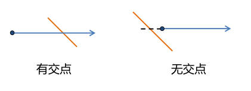

判断一个点是否在多边形内有几种不同的思路：
* 射线法：从判断点向某个统一方向作射线，依交点个数的奇偶判断；
* 转角法：按照多边形顶点逆时针顺序，根据顶点和判断点连线的方向正负（设定角度逆时针为正）求和判断；
* 夹角和法：求判断点与所有边的夹角和，等于360度则在多边形内部。
* 面积和法：求判断点与多边形边组成的三角形面积和，等于多边形面积则点在多边形内部。   
面积和法涉及多个面积的计算，比较复杂，夹角和法以及转角法用到角度计算，会涉及反三角函数，计算开销比较大，而射线法主要涉及循环多边形的每条边进行求交运算，但大部分边可以通过简单坐标比对直接排除，因此这是比较好的方法。

<!–-break-–>

# 射线法的原理
射线法就是以判断点开始，向右（或向左）的水平方向作一射线，计算该射线与多边形每条边的**交点个数**，如果交点个数为奇数，则点位于多边形内，偶数则在多边形外。该算法对于复合多边形也能正确判断。

# 射线与边相交
射线法的关键是正确计算**射线与每条边是否相交**。并且规定线段与射线重叠或者射线经过线段下端点属于不相交。首先排除掉不相交的情况，下图的情况都是需要排除掉的：

排除掉上述情况真正需要求交点来判断的情况只有两种：

用python实现代码如下：

def isRayIntersectsSegment(pt,s_pt,e_pt):
    '''判断某射线是否与一个线段相交，射线是一条水平向右的射线。
    Arguments:
        pt: 射线的顶点坐标(point) [x,y]
        s_pt: 线段的起始点坐标(start_point) [x,y]
        e_pt: 线段的终止点坐标(end_point) [x,y]
    returns: 
        是否相交 true/false
    '''

    if s_pt[1]==e_pt[1]: # 排除与射线平行、重合，线段首尾端点重合的情况
        return False
    if s_pt[1]>pt[1] and e_pt[1]>pt[1]: # 线段在射线上边
        return False
    if s_pt[1]<pt[1] and e_pt[1]<pt[1]: # 线段在射线下边
        return False
    if s_pt[1]==pt[1] and e_pt[1]>pt[1]: # 交点为下端点，对应s_pt
        return False
    if e_pt[1]==pt[1] and s_pt[1]>pt[1]: # 交点为下端点，对应e_pt
        return False
    if s_pt[0]<pt[0] and e_pt[0]<pt[0]: # 线段在射线左边
        return False

    # 求交点：若将射线视为直线，xseg为其与线段的交点
    xseg=e_pt[0]-(e_pt[0]-s_pt[0])*(e_pt[1]-pt[1])/(e_pt[1]-s_pt[1]) 
    if xseg<pt[0]: # 交点在射线起点的左侧
        return False
    
    return True  # 排除上述所有情况之后


函数`isRayIntersectsSegment()`里**求交点**的部分就是利用两个三角形的比例关系求出交点在起点的左边还是右边；用图去理解如下：

# 判断点在多边形内
接下来遍历多边形的每条边，统计交点个数就可以判断点是否在多边形内了。   
python实现代码如下：

def isPointWithinPolygon(pt,poly):
    '''判断某点是否位于多边形内。
    由该点水平向右发出一条射线，如果与多边形有奇数个交点，就说明该点在多边形内；
    反之说明该点在多边形外。
    Argument:
        pt: 某点坐标(point) [x,y]
        poly: 多边形顶点集(polygon) [[x1,y1],[x2,y2],...,[xn,yn]]
    Returns: 
        是否位于多边形内 true/false
    '''

    sinsc=0 # 交点个数
    n = len(poly) # 总共n条边
    for i in range(n-1): # 循环前(n-1)条边
        s_pt = poly[i]
        e_pt = poly[i+1]
        # 如果该点发出的射线与线段相交
        if isRayIntersectsSegment(pt,s_pt,e_pt):
            sinsc += 1 #有交点就加1
    # 最后一条边
    s_pt = poly[-1]
    e_pt = poly[0]
    if isRayIntersectsSegment(pt,s_pt,e_pt):
        sinsc += 1

    return True if sinsc%2==1 else  False


# 测试
最后我们可以测试一下

poly = [(1,1),(2,3),(5,4),(5,1)]
pt1 = (1,2) # 外
pt2 = (4,4) # 外
pt3 = (3,2) # 内
pts = [pt1,pt2,pt3]

for i in range(len(pts)):
    if isPointWithinPolygon(pts[i],poly):
        print("within")
    else:
        print("outside")


# 参考
https://www.jianshu.com/p/ba03c600a557   
感谢这篇文章，虽然代码有错但是我改过来了:

- if s_pt[0]<pt[0] and e_pt[1]<pt[1]: # 线段在射线左边
+ if s_pt[0]<pt[0] and e_pt[0]<pt[0]: # 线段在射线左边


