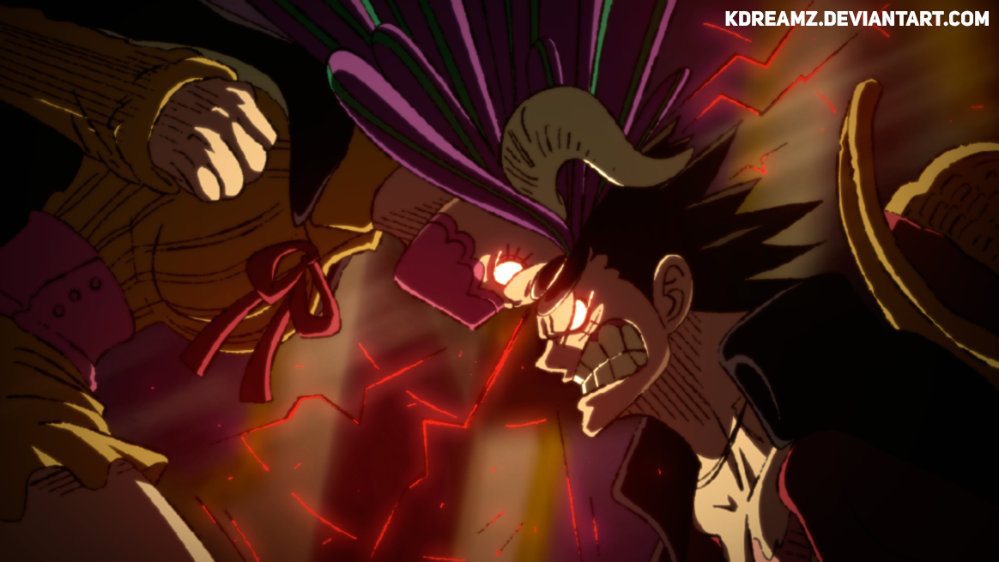







## littlepure

Hi, I'm littlepure, a newcomer of computer vision. I like to create, experience interesting things. I always believe in a word "one is born to do a big thing". And I wish I can live a life not for nothing.😎

